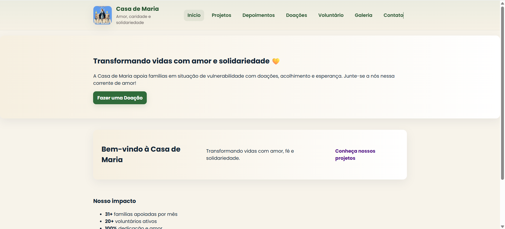
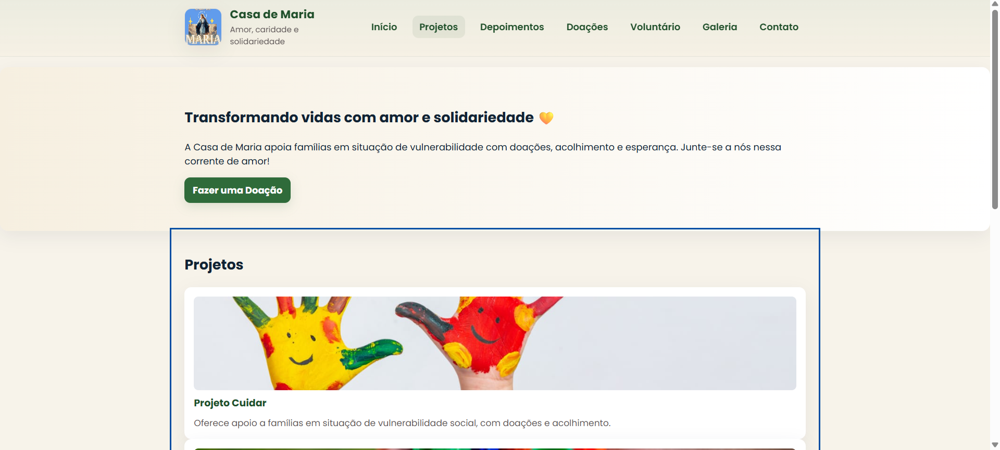

# 🌸 ONG Casa de Maria — Entrega IV (Acessibilidade e Deploy)
A ONG Casa de Maria é uma aplicação web completa e acessível, desenvolvida como parte da Entrega IV da disciplina de Desenvolvimento Web.
Este projeto consolida todo o aprendizado, aplicando práticas profissionais de versionamento com Git/GitHub, acessibilidade conforme WCAG 2.1, otimização para produção e deploy em ambiente real.

# 🌐 Visualização do Projeto
Acesse o site publicado no GitHub Pages:
👉 https://nathalybonfim.github.io/ONG-CasadeMariaIV/

# 💻 Funcionalidades Principais
🌍 Navegação SPA (Single Page Application)
Permite uma experiência fluida sem recarregamento de página.

# ✨ Manipulação dinâmica do DOM
Conteúdos das seções são carregados via JavaScript.

# 🧩 Templates modulares
Organização do conteúdo em módulos JS reutilizáveis.

# 📝 Validação de formulários com feedback visual e acessível
Campos obrigatórios e alertas otimizados para leitores de tela.

# 💗 Simulação de doações via PIX
Interatividade simulando o fluxo de doação.

# 👥 Formulário de voluntariado com validação dinâmica
Usuário recebe resposta imediata ao enviar dados.

# 🦻 Acessibilidade aprimorada (WCAG 2.1)
Uso de atributos aria-*, contraste de cores, navegação por teclado e textos alternativos em imagens.

# 🚀 Deploy otimizado no GitHub Pages
Estrutura revisada e validada para ambiente de produção.

# 🧱 Estrutura do Projeto
ONG-Casa-de-Maria/
├─ index.html
├─ README.md
├─ /css/
│  ├─ style.min.css
├─ /js/
│  ├─ spa.js
│  ├─ templates.js
│  ├─ form.js
│  ├─ main.min.js
├─ /imagens/
│  ├─ logo.jpg
│  ├─ familias.jpeg
│  ├─ tampinhas.png
│  ├─ psi.png
│  ├─ lar.png
│  ├─ cuidar.jpg
│  ├─ voluntarios.jpg

# 🧭 Acessibilidade Implementada
Contraste verificado com ferramentas automáticas (WCAG 2.1 AA).

Textos alternativos (alt) em todas as imagens.

Navegação funcional via teclado (tabindex).

Uso de rótulos (label) e aria-label em formulários.

Estrutura semântica correta com header, main, section, article, footer.

Leitura fluida para tecnologias assistivas.

# 🧩 Tecnologias Utilizadas
HTML5 (semântica e estrutura)

CSS3 (layout responsivo e contraste)

JavaScript (ES6+) (interatividade e SPA)

Git/GitHub (controle de versão e deploy)

GitHub Pages (hospedagem do site)

Ferramentas de Acessibilidade: Lighthouse, WAVE, Contrast Checker

# 🖼️ Demonstração Visual

# 👩‍💻 Autora
Nathaly Bonfim — Desenvolvedora Front-End
📧 [nathaly.bonfim@hotmail.com]
📱 (11) 97766-1218

# 🏁 Status do Projeto
✅ Finalizado e publicado
🎯 Entrega IV — Versão acessível e otimizada para produção
